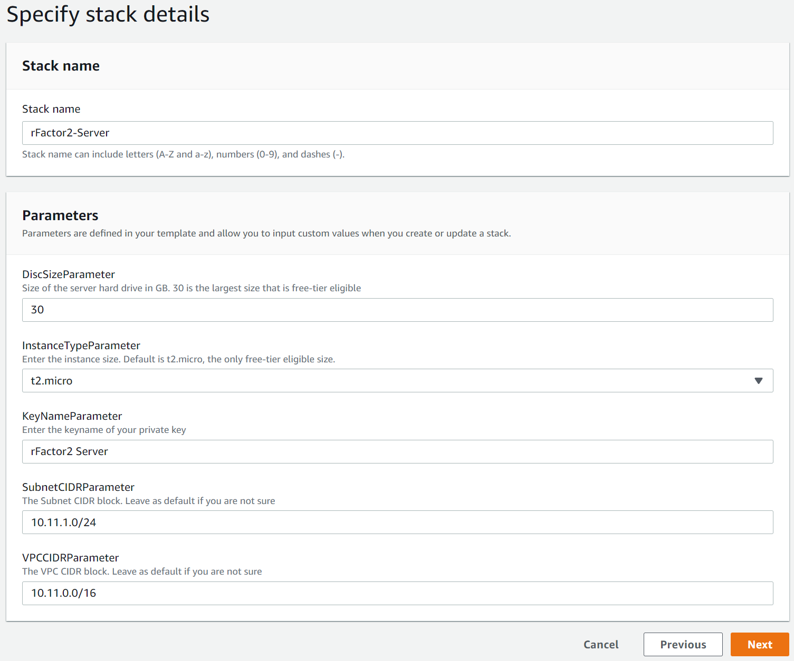
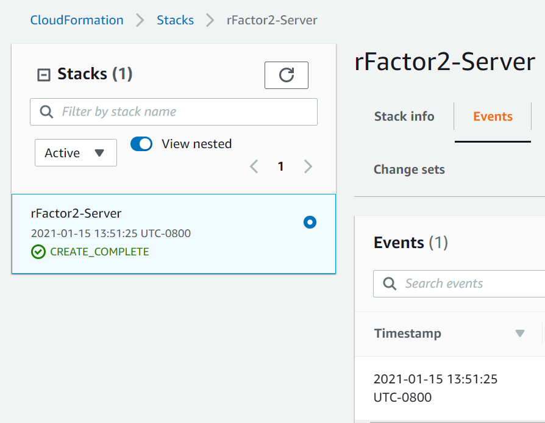
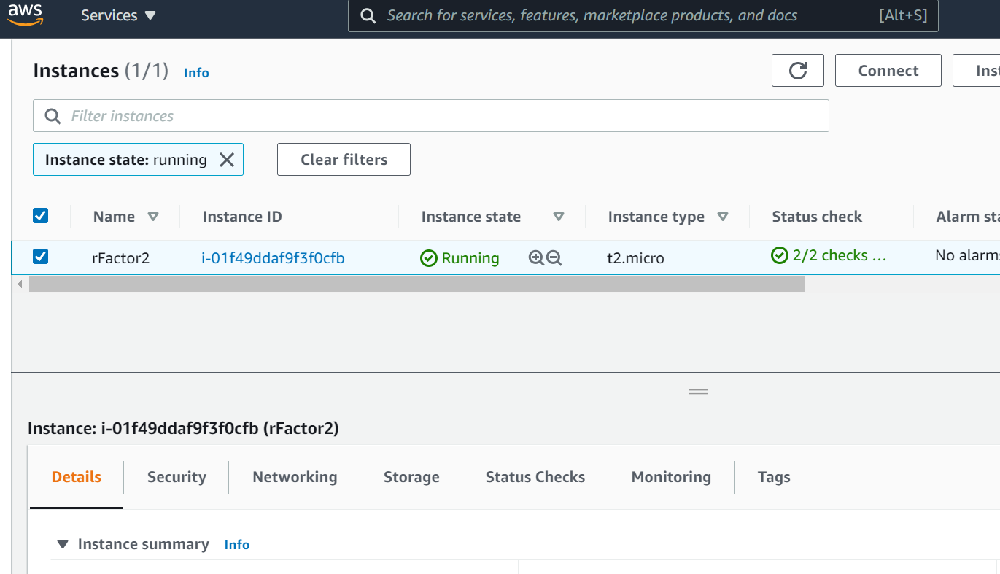

# rFactor2 Dedicated Hosting (on AWS for free)

This guide is intended to simplify the process of hosting a dedicated rFactor2 server, as well as cover every step on how to create, host, and manage your events in detail. If you choose to host on AWS using this guide we will automate as much of this work as possible. You don't need to know anything about coding or AWS at all, or anything about setting up your home network or how to host a server. All you need to know is rFactor2 is awesome and would be way more awesome with your own multiplayer server. 

The only thing you need to get started is:

- An [AWS account](https://aws.amazon.com/free/). Just signup and give them some payment info.
- Remote Desktop (Windows Pro) or an application that can make a remote desktop connection.

Once you are done you will have a server that you can run for free, and also start and stop at whim. That way if you don't want to leave the server running all the time (i.e. not pay for it all the time), but would like to be able to start it up again easily, you can. Think it like a managed hosting provider that you will pay a fraction for, if hardly anything at all, and can run completely on demand.

## Index

- [rFactor2 Dedicated Hosting (on AWS for free)](#rfactor2-dedicated-hosting--on-aws-for-free-)
  * [Creating rFactor2 server on AWS](#creating-rfactor2-server-on-aws)
    + [Choose an AWS region](#choose-an-aws-region)
    + [Setup a key pair](#setup-a-key-pair)
    + [Use CloudFormation to create rFactor2 server](#use-cloudformation-to-create-rfactor2-server)
    + [Connect to your rFactor2 server](#connect-to-your-rfactor2-server)
    + [rFactor2 dedicated on your server](#rfactor2-dedicated-on-your-server)
    + [Additional environment details](#additional-environment-details)
    + [Destroying your AWS rFactor2 server](#destroying-your-aws-rfactor2-server)
    + [Other cool things you can do hosting on AWS](#other-cool-things-you-can-do-hosting-on-aws)
  * [Using rFactor2 server](#using-rfactor2-server)
    + [Downloading workshop mods](#downloading-workshop-mods)
    + [Using ModMgr to install workshop mods](#using-modmgr-to-install-workshop-mods)
    + [Using MAS2 to create events](#using-mas2-to-create-events)
    + [Running rFactor2 Dedicated server events](#running-rfactor2-dedicated-server-events)
  * [Hosting events with DLC](#hosting-events-with-dlc)
    + [Downloading DLC mods for the server](#downloading-dlc-mods-for-the-server)
    + [Authorize server to use DLC](#authorize-server-to-use-dlc)
  * [Troubleshooting](#troubleshooting)

## Creating rFactor2 server on AWS

Once you have your aws account setup and you are logged into the aws console you're ready to setup your server. If you aren't familiar with cloud services like AWS you might be a little overwhelmed, but don't worry there's only a few steps, and you don't need to understand much of what's going on, although we will do our best to explain it all as we go.

### Choose an AWS region

The first thing you need to decide is what region to deploy your server. This is the actual physical location of the AWS data center where your server will be deployed. It's important to choose the AWS region closest to your home or business for the lowest possible latency (ping time), and thus best experience. Select the region dropdown and then select your desired location.


### Setup a key pair

In order to access the server we are about to create you will need to generate a public/private key pair. AWS makes this easy for us.

1) In the AWS search box search for `EC2` and click on it.
<br/>

2) In the list of EC2 functions on the left, scroll-down to `Network & Security` and click on `Key Pairs`.
<br/>

3) Enter a name for your key, in this example we will name it "rFactor2 Server", and select the `pem` format, then click the `Create key pair` button.
<br/>

This will create and download a file called `rFactor2 Server.pem` in your Downloads folder, which is actually the private key to access your server. If you ever lose the private key file you won't be able to login to your server anymore, and will need to delete and recreate everything with a new key, so keep your key safe.

### Use CloudFormation to create rFactor2 server

Here's where the magic happens. To avoid any of the scary parts of configuring AWS, I have created a CloudFormation template that will automatically create everything for you. That's right; *everything*. The windows server, all firewall rules, steamcmd, and rFactor2 dedicated, all will be created or downloaded and then setup and ready to go. If you aren't deeply familiar with AWS even the most basic task of launching and connecting to a server can be fairly daunting, but even if you are setting them up can be annoyingly time consuming, so having a simple template to do it all for us makes life soooo much easier.

You can view the raw template at `rfactor2server.cftemplate` in this gist if you are interested, but if you have no idea what I'm talking about don't worry about it, you don't need to look at it at all. I'm simply including it so any technical folks can modify that template for their own needs if desired.

1) In the AWS search bar at the top search for `CloudFormation` and then select it.

2) On the CloudFormation homepage click `Create stack`.

3) Copy this url `https://rfactor2-server-setup.s3.amazonaws.com/rfactor2server.cftemplate` into the `Amazon S3 URL` field for the template to use. This is a public URL for the rfactor2server.cftemplate file. Click `Next`.

You will now be presented with some customization options for your server stack. 

Enter a stack name - anything you like - and change the `KeyNameParameter` to the name of the key you generated earlier. We generated a key named "rFactor2 Server" in this example, so that's what we should enter for the key name.

> Note: if you want to run multiple instances of an rFactor2 server on the same machine I would recommend increasing the instance size, so change the `InstanceTypeParameter` to either a t2.small or t2.medium. I haven't done extensive load profiling of rFactor2 server yet, so can't give much guidance on exactly how much CPU, RAM, etc. the server needs to host a game of 45 people. In the brief testing I have done on a t2.micro it seems like it would be perfectly fine for one rFactor2 server, but my gut says the RAM and CPU would be limiting for multiple instances of rFactor. I would bet you can run 3 or maybe even 4 instances of rFactor2 on a t2.medium, but of course without thorough testing can't be certain.

See some final example settings below.



4) Click the `Next` button after configuring your key name and stack name in the stack details.

5) On this page you can simply skip all options and click `Next` at the bottom of the page.

6) The summary page will tell you all changes that are about to be made. Scroll to the bottom and click `Create Stack`.

Once stack creation is started it can take up to 15 minutes for everything to finish, so take a break while you wait and pat yourself on the back for making it this far. You're gonna be turning laps on your own server in no time. When everything is complete the status will change to `CREATE_COMPLETE` like in the below screenshot.



If for some reason you encounter an error during stack creation take a look at the troubleshooting items at the bottom of this guide around AWS.

### Connect to your rFactor2 server

With the stack created you can now connect to the server to start setting up events. For this we will be using RDP (remote desktop), so if you don't have Windows Pro you will need to install [Microsoft Remote Desktop](https://www.microsoft.com/en-us/p/microsoft-remote-desktop/9wzdncrfj3ps#activetab=pivot:overviewtab) or a similar application capable of establishing a remote desktop session.

First you need to get the connection settings and credentials for your server.

1) Leave CloudFormation and go back to the main [AWS console](console.aws.amazon.com) by clicking on the AWS logo in the top left.
<br/>

2) You should now see `EC2` in the list of recently visited services. Click on it to go back to `EC2`.

3) The EC2 dashboard should show you now have at least one running instance. Click on `Instances` under the Instances drop-down, or on the dashboard.

4) Select the rFactor2 instance checkbox as shown below and then click `Connect` in the top right.
</br>

5) Select the RDP client tab so we can get the Admin password. Click on `Get password` as shown below.
</br>  

6) Click `Browse` and open the private key file. In our example we have the key "rFactor2 Server.pem" so that file was opened. The text content shown in the textarea shows the beginning of the private key. With the key entered click `Decrypt Password` at the bottom right.
<br/>

7) You will end up back on the `RDP client` tab with all necessary connection info. It should look like below.
<br/>

> Note: ***the password is temporary***, so if you try to remote desktop to the server after some time you may find a saved password doesn't work anymore, and the password will need to be regenerated in AWS using the above process again, so don't lose that key file.

From here you can either manually input the Public DNS host, Username and Password, or you can simply download that remote desktop file using the button and click it to automatically start a remote desktop session where all you need to do is enter the password.

Here's an example of a manual RDP setup to connect to our rFactor2 server:

1) Open Remote Desktop on Windows or an equivalent application.
2) Copy the host and the username, and click Connect
<br/>
3) Copy and submit the password when prompted
<br/>
4) Accept the server certificate by clicking Yes
<br/>

Once complete it will load a new window on your computer with your new Windows server. Sweet you're nearly up and running now.

### rFactor2 dedicated on your server

Thanks to the CloudFormation template, when the instance is started for the first time it runs a powershell script in the background to fetch steamcmd and rFactor2 dedicated, and setup the environment so everything is ready to be used. All that's left is for you to create the events and start the rFactor2 dedicated server. You can find rFactor2 server and all utilities in the `C:\rfactor2-dedicated` folder, so just open up file explorer, go there, and you should see a folder like below:


> Note: if you don't see the `rFactor2 Dedicated.exe` in this folder and you just created the stack then you may have simply connected to the server before the background bootstrap script has completed. Just wait a little longer and everything should end up looking like the screenshot above.

### Additional environment details

For those of you who have done this before you will notice that our folder structure is a little different from what the official documentation recommends, in that we have actually copied all the executables into the root directory instead of creating shortcuts to them. The reason for this is it solves a couple little pathing issues we ran into with ModMgr.exe and rFactor2 Dedicated.exe. 

In my testing of ModMgr.exe, when run from within the Bin64 directory it adds the Bin64 directory to the path for the installed mods and packages. By simply copying to the root it defaults to the correct paths for the Installed and the Packages folders that are located at the root folder, and helps avoid this annoying split install situation where some of the files get installed to the root and some of it into the Bin64 folder due to just not understanding its settings. Surely, for a newcomer, the process of actually creating the mod you want to host is confusing enough as it is without this extra hurdle. This one isn't technically a bug but it's... poorly optimized shall we say.

The reason for copying the rFactor2 Dedicated.exe into the root folder is largely the same "bug", in that it solves pathing problems the apps run into, and avoids the need for creating a shortcut with a +path parameter, and is more easily scriptable.

MAS2.exe also gets copied over to the root directory simply for ease of use and consistency.

### Destroying your AWS rFactor2 server

If you ever decide you don't need your server anymore you can easily destroy all AWS services through the CloudFormation dashboard. There is a very simple Delete option for the selected CloudFormation stack.

### Other cool things you can do hosting on AWS

In the EC2 instance list (where you got the server connection settings) you can select the instance as you did before, select the `Instance State` dropdown, and Stop the instance. This is the equivalent to powering down your PC at home. It will still be there for you if you want to start it again, and instances have no cost when they are stopped so it can be a great cost saving measure.

Another thing you can do to manage cost if you're running a large server with lots of rFactor servers on it, or lots of small servers each with its own rFactor server, is take advantage of AWS reserved instances. AWS reserved instances come at a much lower cost if you are willing to commit to minimum term length of either 1 or 3 years. For leagues this would be a dirt cheap way of running the league servers.

## Using rFactor2 server

Alright you're connected to your server, all the basics are downloaded and setup. Now how do you use this thing?

Documentation on how to actually create events and host them is very inconveniently spread out across 397 forums, steam forums, and various other places. This slowed me down considerably when setting it up for the first time. Here I will pull together everthing you need to know in one place. If you did the AWS setup from above that's great - you're going to have a race up and running in all of 5 minutes now - but this part of the guide is useful no matter how you plan to host.

There are three executables you will need to use to create and host an event/race, and you will basically use them in the order presented when setting up your server for the first time.

| Application | Usage |
|---|---|
| ModMgr | Used to unpack the *.rfcmp mod files downloaded from steam, and to install the mod files into the correct server location. It can also be used to remove or delete installed mods. |
| MAS2 | Create custom mods, in this case very likely a race or series of races, using the installed mods from ModMgr, and package them for the server. |
| rFactor2 Dedicated | Host the custom mod created with MAS2 which you can join in multiplayer rFactor2. |

### Downloading workshop mods

> Note: if you created your server using our AWS guide you can skip this step for now and use the two test assets automatically downloaded to quickly test your server. Jump ahead to [Using ModMgr to install workshop mods](#Using-ModMgr-to-install-workshop-mods) if you want to come back to this later.

ModMgr can be used to install mod files that have already been downloaded from the workshop, but unfortunately you need to fire up a cmd or powershell terminal to first fetch the desired mods from steam using steamcmd. 

For any mod you wish to host in an event start by finding that item in the workshop, and then copy its id from the steam URL bar. Here's an example:


Click on the windows search box in your server, search for `powershell` or `cmd`, and open it. I will demonstrate this assuming usage of the AWS hosting guide from above, but the process would be basically the same if your steamcmd folder is at a different path. Enter the below commands in powershell one-by-one and hit enter. Replace WORKSHOP_ITEM_ID with the id of the steam workshop mod you copied earlier.

```shell
cd C:\steamcmd
./steamcmd +login anonymous +workshop_download_item 365960 WORKSHOP_ITEM_ID +quit
```

Use the above steam command for every workshop mod you want to use, and they will end up in the `C:\steamcmd\steamapps\workshop\content\365960` folder. If you look at the files you will see they are all *.rfcmp files. You need to copy all these files into the `C:\rfactor2-dedicated\Packages` folder. Here's a powershell command that will copy over all .rfcmp files to the packages folder:

```shell
cp C:\steamcmd\steamapps\workshop\content\365960\*\*.rfcmp C:\rfactor2-dedicated\Packages\
```

Once you're done downloading any mods and they are all copied over to the packages folder you can close the powershell window.

### Using ModMgr to install workshop mods

Open ModMgr and it should look relatively similar to below.


Make sure both the `Mods` and the `Components` checkboxes at the top left are checked to see everything.

If you still don't see any mods, make sure the filepaths you see for "Install:" and for "Packages Dir:" are at the root of the rFactor2 dedicated folder. If those filepaths are not set to the root of the rFactor2 dedicated server folder then you can change the paths by clicking the little `B` button to the right of the "Working Dir:" and the "Packages Dir:" fields.

In the above example we have two mods we downloaded from Steam that we need to install; Sau Paulo GP and the Tatuus FT-50. Select one of the mods, the `Install` button will become active, and you can click it to install that mod to your rFactor2 server.

As you probably have guessed already from the screenshot, this can also be used to uninstall or delete installed server mods as well. Just select the mod you want to remove and the buttons will become active.

The `Update` button will sometimes become available if there as an update available for an installed mod. You may see this with some of the DLC mods. Simply click it and ModMgr will fetch the updated version.

With some mods installed you can move onto creating a race event with MAS2.

### Using MAS2 to create events

With the MAS2 application we can create a custom mod, that bundles the selected mods installed from the workshop, and effectively specifies to the server what tracks, cars, and other custom components can be used on the server.

Open MAS2 and we will create a simple mod with Sao Paulo and the Tatuus. 

1) Click the box icon that we have highlighted in red, and then click `Create New Mod Package`.
<br/>

2) Give your mod a name. This name appears in the lobby of the server when players join. In the below example a custom path is set for the rfm MAS file cause it can be helpful when editing it later or for backups. Click Next once you have your mod name and file paths setup.
<br/>

3) Now we get a track selection screen where we can select the desired tracks that will be cycled through on the server after each event finishes. If you don't see any tracks here go back to the ModMgr section on how to install workshop mods. Select the Sau Paulo track and click `Next`.
<br/>

4) Next is the car selection screen. Select the Tatuus and click `Next`.
<br/>

5) On the components screen you don't need to select anything, since all clients will already have these default assets installed with rFactor2. Click `Done`.
<br/>

6) Here you can select which teams are available and what track layouts for the selected track/(s). In this case we only have one track layout, and will allow all Tatuus teams. When changing values here change only the Layouts or the Teams checkboxes. Click `Package` to bundle your mod when ready.
<br/>

> Note: Don't select any of the checkboxes for the small Locations and Vehicles windows. This unnecessarily increases the mod size, and seems to be some kind of legacy functionality to include all assets to be served with the mod. Not needed.

7) After the mod has been packaged click the `Install` button to install it to the server. If successful the red square will turn green as shown below, and the Uninstall button will become active.
<br/>

The new mod will now be available to rFactor2 dedicated server the next time it's started. Click `Done` to close the window, and you can also close MAS2 if you don't want to create another mod.

### Running rFactor2 Dedicated server events

If you jumped right here and didn't read the sections on ModMgr or MAS2 go back and check those out, otherwise you're gonna have a bad time. The server needs a valid mod.

With our mod created it's time to fire up the server and test it.

1) Start rFactor2 Dedicated.exe on the server and you should see this. If not it's most likely because the server cannot find a valid custom mod installed.
<br/>

2) Select the mod you want to run in the dropdown, and enter an admin password. Click `Vehicles`.
<br/>

3) On the vehicle selection screen you can further change which cars will be available on the server, or set a few other limations, like limit the allowed driving camera views. Click `Config` when finished.
<br/>

4) On the track selection screen you can limit allowed tracks similar to the vehicle selection, and there are a number of other important server options here as well. By selecting the SaoPaulo GP track the `Weather` button becomes active, and if clicked presents additional options where we can set more fine grained weather behavior for the event. The maximum number of players slider can be useful in the event you start seeing lag with larger numbers of people. Click `Options` when done.
<br/>

5) Lastly, we are presented with all the final server options before it starts. The race name field is what appears in the server list when searching for servers in game in rFactor2. The password field is optional, and if left blank will create a public server that anyone can join. Set all desired options for the event and click `Load Track` to start the server.
<br/>

After a few seconds everything will load and the server status screen will appear as shown below. Once you see an active Uptime counter and Session Status countdown the server is online and should be visible in the rFactor multiplayer server list.


If you want to shut the server down simply click `Exit` and the server will shutdown. If you want to leave it running all the time don't click exit and just leave the window up and close your remote desktop session. This window will show any users that have connected to your server, and obviously acts as an admin control panel for kicking users or advancing the session. With the Add AI button you can add an AI opponent to the session.

Okay, moment of truth time. Start rFactor2 on your PC and open up the multiplayer server list. You can search for the server event by name, in this example the event name is "Test Race", or I like to just sort by ping and then it ends up somewhere near the top of the results.


Select your test server and make sure you can connect. If you get this you know all is well:


If you followed this guide the whole way through, big congrats, you're basically a software engineer now. Many of you know how painful this seemingly simple setup process can be with rFactor2 dedicated server, and hopefully this AWS approach has helped save you a lot of pain, and perhaps even some dollars.

## Hosting events with DLC

Running events with DLC content is obviously a little different since the workshop content isn't freely available. Users that want to join the event will also need to have paid for the DLC.

### Downloading DLC mods for the server

In order to download this content and install the mods for your server open Steam > View > Inventory, as shown below.


From the inventory page you can view the DLC content you have downloaded for rFactor2. Click on any mod you want to use to view its workshop page and grab the id of the workshop mod.


With the id for the DLC mod you can now use the steamcmd to download the mod package file. The commands for powershell are below. Replace the uppercase strings with the correct data.

```
cd C:\steamcmd
./steamcmd +login STEAM_USERNAME STEAM_PASSWORD +workshop_download_item 365960 WORKSHOP_ITEM_ID +quit
```

If you are running the steamcmd for the first time from your server steam will require a one time second factor of authentication, and will put up a prompt like below. If you downloaded a free workshop mod already the reason you did not get this process is that steamcmd was authenticated as an anonymous user, and this time you are authenticating as yourself.


Open your email and you should find an email from steam with the code you need to enter to complete authentication. It will look like this:


Type that code into the command line and steam will download the DLC for you just like other workshop mods, and you won't have to do that two-factor process again on that machine.

When you are done downloading mods you can copy them all over to the server packages folder using the below command.

```
cp C:\steamcmd\steamapps\workshop\content\365960\*\*.rfcmp C:\rfactor2-dedicated\Packages\
```

Now you can unpack and install these mods to the server using ModMgr. See the above section [Using ModMgr to install workshop mods](#Using-ModMgr-to-install-workshop-mods) for more info.

### Authorize server to use DLC

With the mods downloaded and installed, you need to generate a valid token for the server, so that you have the ability to select the DLC during mod creation and can add it to your mod. If a valid key isn't provided the DLC simply won't appear in the MAS2 vehicle list, and ModMgr will not allow you to install it.

To generate the token for your server:

1) Open the rFactor2 game install folder on your gaming machine. Open Steam, go to rFactor2 in your Library, right-click on it, hover over Manage, and select Browse local files.
2) Remote desktop to your server, and open `C:\rfactor2-dedicated\UserData`
3) Copy the `ServerKeys.bin` file from your server to the same `UserData` folder on your gaming machine where you play rFactor2.
4) Start rFactor2 and let the game launch. The game only needs to launch and then you can close it.
5) Go back to your rFactor2 install folder on your gaming machine, and inside the `UserData` folder there will now be a `ServerUnlock.bin` file there. Copy it to `C:\rfactor2-dedicated\UserData\ServerUnlock.bin` on your rFactor2 server. In the end the UserData folder on the server should have both a `ServerKeys.bin` file and a `ServerUnlock.bin` file.

Now you can follow the same steps outlined earlier in this guide for installing mods with ModMgr and creating mod events with MAS2. 

> Note: When using DLC content in an event you might notice two different versions of a vehicle. In this case select the latest version, and only the latest version of the car to add it to your mod.

## Troubleshooting

- **I can see my server but when I click the Join button nothing happens**

  There seems to be a bug with the click area of that button. Make sure to click on the actual "join" text and not in another area on the button.

- **I can't see my server in rFactor2**

  If you followed the AWS guide to launch your server, and the part about how you create a mod and start the server, then this shouldn't happen unless steam goes down or you stop the server. 

  If you're hosting this yourself make sure you **check both** the network firewall (the router), **and** the server firewall. It's easy to miss a port on the router, or not open up the firewall on the server. On windows search for "Windows Firewall" in the windows search box and then select "Allow an app through the windows firewall" and you can create a rule to allow rFactor2 Dedicated.exe access on the network from the machine it will run on. 
  
  Next, double check that you got all the correct ports and protocols (TCP/UDP) forwarded from the router to the server using port forwarding. If you don't know how to setup port forwarding google it and you should come up with a wealth of information. Here are the port numbers and protocols for convenience:

  - TCP and UDP - 54297 - rfactor "simulation" port
  - TCP - 64297 - rfactor http port
  - UDP - 64298 - steam port
  - UDP - 64299 - steam port

  And really, don't close any of these. They all need to be open. I've seen some users closing the steam ports for some reason and then wondering why they can't see their server; it's because those ports are used for discovery.
  
  Also make sure the server has a static ip address on the network to avoid future headaches if the ip address changes because of a reboot or some other event that causes downtime. 
  
  Failing to do any those things, or even a teeny tiny little typo, will mean the server can't be reached from outside the network.

- **I setup and host a local server but can't see it in rFactor2**

  I haven't tested the local LAN use-case myself, but I have read in a number of places people with the same problem who solved it by updating the ports used by the server. The fix makes sense to me if the problem is the client is listening on different ports for LAN games than for internet games. Give that fix a try. 
  
  You need to update the `.\rfactor2-dedicated\UserData\player\Multiplayer.json` file with the new http port number, and then start the server.

  - TCP and UDP - 54297 - rfactor "simulation" port
  - TCP - 27013 - rfactor http port
  - UDP - 27014 - steam port
  - UDP - 27015 - steam port

- **When connecting to my rFactor2 server in game I get an error that the mod could not be downloaded**

  This error is most commonly caused by either mods or the applications being installed in the wrong folders. Each application is highly sensitive to the path and directory structure. Take a look at the section towards the beginning of this guide on [Additional environment details](#Additional-environment-details) in the AWS setup section. There's some useful info there for you even if you aren't using the AWS portion about how the applications are sensitive to pathing problems, and without the simple setup we talk about there I struggled a fair amount with this error as well. The build structure for rFactor2 dedicated is basically broken imho, nobody could argue that it's not dumb, but easily fixed if you copy what we do there. It could also easily be fixed by the developers but clearly they are very lazy, or I don't know maybe they just don't work on this anymore.

- **I followed the AWS guide but the rFactor2 Dedicated.exe never populated in the root folder**

  That is odd. Every now and then after bootstrapping there can be issues with AWS network connections for longer than usual. If the executable never gets populated in the `rfactor2-dedicated` folder you could try deleting it and the steamcmd folder, and then copy the rf2serversertup.ps1 powershell script in this repo to your server. Copying it anywhere to the server is fine, and then right-click on it and select Run in powershell. This will re-run the scripted setup process that fetches steamcmd, the rFactor2 dedicated server, and sets up the folder and firewall. Powershell may prompt you about the execution policy, which you can skip by entering "N" and then enter.

- **I followed the AWS guide but CloudFormation returned an error when creating the stack and rolled back**

  If the stack creation failed in CloudFormation it's most likely because the key name given doesn't match the actual key name in EC2 under Key Pairs. Delete the stack and recreate and double-check you give it the right key name. I'm not sure if it's case sensitive, I always enter the exact key name. If you didn't do the part in this guide to create an AWS key pair, then make sure to do that first.

- **I lost my private key file and can't remote desktop to my server**

  Bummer that server is burned now. The only thing you can do is delete the CloudFormation stack and create a new one with a new key pair. But hey, at least that's pretty easy with this handy guide.

- **My AWS server lags when there are lots of people connected**

  I didn't do a huge amount of load testing on the server before writing this up so if you find that you consistently have problems with 40 people or whatever on a t2.micro instance your best bet is going to be to delete the stack in CloudFormation, and then recreate it with a slightly larger instance size. Remember you can always stop the instance and start it again when you want it if you only want to pay for what you use.

  If you are running multiple rFactor2 servers on one large instance and start experiencing lag, the bottleneck may actually be the network, and you would be better off running multiple smaller servers with fewer rFactor2 servers running on them to spread out the network load over more machines and interfaces.